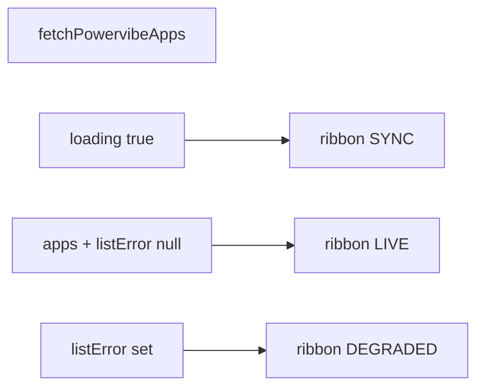

# Home.vue command center upgrade (charts + dark workbench)

## Current baseline

- [`app/src/components/home/Home.vue`](app/src/components/home/Home.vue) already has: sticky nav, dark hero, directory table with `fetchPowervibeApps`, `PowervibeAppStatusBadge`, `formatPowervibeAppUpdatedAt`, `goPowervibe` / `openAppInWorkspace` / `scrollToApps`, and three “pillar” columns.
- Dependencies [`chart.js`](https://github.com/chartjs/Chart.js) and [`vue-chartjs`](https://github.com/apertureless/vue-chartjs) exist in the root [`package.json`](package.json) (same stack as the PowerVibe preview; see [`chartJsSetup.ts`](app/src/components/powervibe/viewer/preview/chartJsSetup.ts) for registration patterns).
- There is **no** dedicated `/api/health` for “database status” in this PoC. **Scribe/DB status** in the UI should be **inferred**: e.g. `SYNC` while loading, `LIVE` when the list call succeeds, `DEGRADED` + message when `listError` is set.

## 1. Visual system (page-local, not global app theme)

Apply the prompt palette **on the home route only** (wrapper on the root `div` of `Home.vue`), so the rest of the app (`/` PowerVibe workspace) keeps existing tokens.

| Token | Use |
| --- | --- |
| `bg-[#0F1115]` (or `bg-zinc-950` if you prefer a named shade close to spec) | Page base |
| `text-slate-100` / `text-slate-400` | Body hierarchy |
| `text-[#3B82F6]` or `text-blue-500` | Accents, chart highlights, CTA focus rings |
| `border-white/5` | Panels, table, nav |

**Logos:** Follow [`branding/logos/SOURCES.md`](branding/logos/SOURCES.md): on dark, use the mark intended for **dark/blue** backgrounds (`horz-dark.svg` for the hero); keep header wordmark legible (often `horz-light` on a separate light strip **or** invert/opacity only if it stays crisp—verify in browser).

**Buttons:** Tweak `Button` usage with Tailwind `class` overrides for contrast on `#0F1115` (primary/outline/ghost) so shadcn tokens do not look washed out.

**Typography:** `tabular-nums` on app counts, IDs, times; use `italic` sparingly for words like *shipped*, *vibe-to-production* per the prompt.

## 2. Infrastructure / “System Status” ribbon

A **full-width** strip under the nav (or integrated into a split hero) showing at minimum:

- **Workspace apps:** `appCount` (from loaded `apps`).
- **Data plane:** A single line, e.g. `Scribe (PostgreSQL)` with state: `Synchronizing…` | `Live` | `DEGRADED: …` driven by `loading` / `listError` / success.
- Optional: **Flight** / **12-factor** as static labels (no new API) to reinforce IaaS/command-center feel.

Use **high-contrast** micro-typography (`text-[10px]` uppercase tracking, `border-b border-white/5`).

## 3. Chart.js “stories with data” (derive from `apps` only)

**Register Chart.js** once for this view (option A: inline `ChartJS.register(…)` in `Home.vue` like generated apps; option B: small [`app/src/components/home/homeChartSetup.ts`](app/src/components/home/homeChartSetup.ts) imported only by `Home.vue` to keep `main.ts` clean).

**Suggested charts (2 small cards above or beside the directory):**

1. **Status mix** — Doughnut or bar: counts by `a.status` (`active`, `draft`, `applied`, `error`) from a `computed`. Single slice when all same status; empty list → empty chart message or a placeholder “No distribution yet” card.
2. **Activity** — Bar or line for **last 7 or 14 days**: bucket `updatedAt` dates from `apps` (count of apps with activity per day, or count of “touch” events = one per app on its last update day). If every app has `updatedAt: null`, show a static “insufficient telemetry” one-liner and hide the second chart or show flat zero.

**Chart theming:** Pass Chart.js `options` with `color: '#94a3b8'`, `borderColor: 'rgba(255,255,255,0.06)'`, `backgroundColor` using semi-transparent blue for bars; `plugins.legend.labels.color = '#cbd5e1'`. Respects the Engineering Dark skin without a global `dark` class on `document`.

**Optional extraction:** If `Home.vue` passes ~350–400+ lines, split non-router UI into:
- `components/home/HomeInfrastructureRibbon.vue`
- `components/home/HomeWorkspaceAnalytics.vue` (Bar + Doughnut only, props: `apps`)

Only extract if the single-file template becomes hard to read—SBT still keeps everything under `components/home/`.

## 4. App directory (IDE / console density)

- Table inside `rounded-lg border border-white/5 bg-[#0B0D12]`-style container.
- Header row: `text-[10px] uppercase tracking-widest text-slate-500`.
- Truncate long names; keep **app_id** in monospace, `tabluar-nums` on dates.
- Row `hover:bg-white/[0.03]`; clear **Execute** or **View** action with electric blue on hover.
- **Empty** and **error** states: full panel with icon, headline, and single CTA—already partly there; align copy with “workspace command” tone (no “Welcome to our app builder”).

## 5. Pillar + narrative copy

- Tighten headings to: **Workspace command**, **Scribe data plane**, **Flight delivery** (subject language).
- Optional bottom: keep one “velocity” line (MCP, agentic) in **one** sentence, not a wall of text.
- The prompt’s *italic* emphasis: apply to 2–3 strategic words, not every heading.

## 6. What not to do

- Do **not** add runtime Gemini to generate the page.
- Do **not** add fake HTTP metrics (claiming ms latency) without a real API.
- Do **not** load Chart.js from a CDN; bundle only (project rule and [`powervibeIdeationRun` guidance](app/src/components/powervibe/ai/plan/powervibeIdeationRun.ts)).

## 7. Verification

- `npm run typecheck`
- Open `/home`: dark shell, two charts re-render when app list changes, ribbon matches fetch state, navigation flows unchanged.
