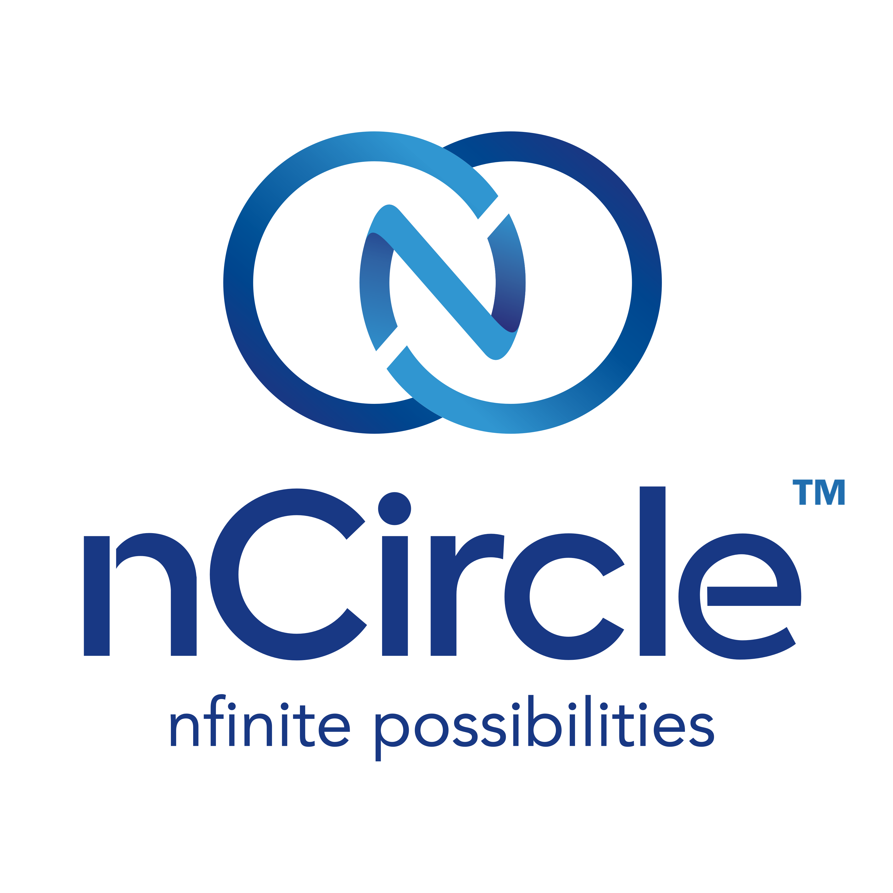
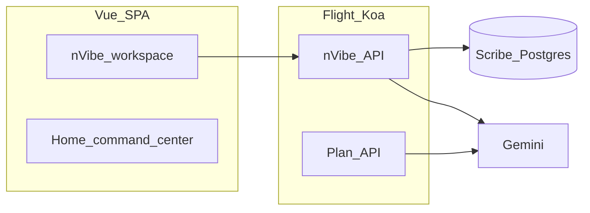

# nVibe · `vibe-to-aec-poc`

**nVibe** is an AI-native platform for **architecture, engineering, and construction (AEC)** — engineering-grade vibe coding for construction IT: **build**, **preview**, and **ship** full-stack software instead of disposable chat demos.

This repository is a **proof-of-concept monorepo** (Vue app, Slidev deck, shared branding). It contains **no production data**.

Tagline from our board narrative: *Vibe to production · Planned · built · shipped.*

---

<p align="left">
  
</p>

<p align="left">
  
</p>

**nCircle Tech** — [ncircletech.com](https://ncircletech.com)

Product and engineering for this phase build on the same delivery bench behind **[ThoughtPivot](https://www.thoughtpivot.com)** ([www.thoughtpivot.com](https://www.thoughtpivot.com)): enterprise AI platform work and the vibe-coding stack, applied here under an **nCircle-led** partnership.

---

## Why nVibe exists

- **Many “vibe” builders** are horizontal chat-to-app toys; few survive enterprise security, deployment, or lifecycle scrutiny.
- **Workflow-first tools** orchestrate steps across systems; they do not hand IT **owned, branded applications** customers run as first-class software.
- **Generic stacks** ignore AEC systems of record (for example Procore; Autodesk ACC / BIM 360–class environments), field realities, and IT operating models — “vertical AI” often stops at demos.
- **AEC IT** needs governance, tenancy, and deploy-under-your-cloud — or deals fail procurement.

## What nVibe is

- **AEC-native agents and integrations** — roadmap agents toward APIs and semantics buyers already use (third-party names are integration targets, not endorsements).
- **IT-owned delivery** — generation power for **IT and innovation teams**, with paths to deploy under customer clouds and identity estates.
- **Company-branded apps** — tenants ship experiences under their brand, not a generic vendor workflow canvas.
- **Git-native output** — generated code can live in **customer repositories** for security review before production.
- **Deploy anywhere** — customer cloud or edge where policy requires; no mandatory lock-in to a single SaaS landlord.
- **Full-stack apps** — Node/Vue applications with audit trails customers can run like other engineering assets — beyond simple workflow builders.

---

## What’s in this repository

### Routes and workspace

| Route | What you get |
| --- | --- |
| **`/`** | **nVibe workspace** — apps rail (multiple generated apps), resizable **AI** panel (Gemini chat and **Apply** when the model returns a valid Vue SFC), **Preview** (live iframe of the materialized app), and **Code** (edit `App.vue` and `App.backend.ts` with Apply). See [`app/src/components/nvibe/Nvibe.vue`](app/src/components/nvibe/Nvibe.vue) and [`app/src/components/nvibe/viewer/NvibeWorkspaceViewer.vue`](app/src/components/nvibe/viewer/NvibeWorkspaceViewer.vue). |
| **`/home`** | Command-center style landing — mirrors the product story and aesthetics used in the Slidev deck. See [`app/src/components/home/Home.vue`](app/src/components/home/Home.vue). |

### Preview, AI, and editing frontend vs backend

- **Preview** renders the **active** app from materialized sources under [`app/src/components/nvibe/viewer/generated/App.vue`](app/src/components/nvibe/viewer/generated/App.vue) (and the worker loads [`…/generated/App.backend.ts`](app/src/components/nvibe/viewer/generated/App.backend.ts)).
- **AI** turns go through Flight APIs ([`Nvibe.backend.ts`](app/src/components/nvibe/Nvibe.backend.ts), [`Plan.backend.ts`](app/src/components/nvibe/ai/plan/Plan.backend.ts)). Ideation-style prompts can produce **prose-only** replies (no fenced SFC → nothing to **Apply**); implementation-style turns can return a full **single-file Vue** fence you **Apply** to persist and refresh preview. Optional **streaming**: set `VITE_NVIBE_CHAT_STREAM=1` in `.env` for SSE on `POST /api/nvibe/apps/:id/messages/stream`.
- **Code** tab uses CodeMirror editors for the Vue SFC and the backend module; **Apply** writes the same sources Scribe holds — same contract as AI Apply. Details and limits (payload size, worker restart) are in [Developer setup](#developer-setup) below.

Persistence uses **Scribe** (Postgres): tables `nvibe_app` and `nvibe_chat_message`; the UI creates a default app if none exist. **`SCRIBE_URL`** defaults to `http://127.0.0.1:1337` in development.

### Architecture (high level)



Shared schemas live in [`shared/`](shared/). Flight discovers [`app/src/**/*.backend.ts`](app/src/components/nvibe/Nvibe.backend.ts). Root [`vite.config.ts`](vite.config.ts) re-exports [`app/vite.config.ts`](app/vite.config.ts) so Flight’s embedded Vite uses this app.

---

## Board slides (Slidev)

The **nVibe for AEC — nCircle Tech Board** deck lives as markdown in [`slides/slides.md`](slides/slides.md) (problem, positioning, competitive landscape, partnership, roadmap, economics, live demo cue). It uses the nCircle token theme via [`slides/setup/main.ts`](slides/setup/main.ts) and [`slides/styles/slides.css`](slides/styles/slides.css).

| Command | Description |
| --- | --- |
| `npm run start:slides` | Slidev at [http://localhost:3030](http://localhost:3030). The nVibe dev server stays on **3001** (`strictPort` in [`app/vite.config.ts`](app/vite.config.ts)) so it does not collide with Slidev. |
| `npm run build:slides:pdf` | Export slides to PDF → [`docs/nvibe-board-slides.pdf`](docs/nvibe-board-slides.pdf) (script in [`package.json`](package.json)). |

Design tokens and written guidelines: [`branding/docs/guidelines.md`](branding/docs/guidelines.md), [`branding/docs/colors-and-type.md`](branding/docs/colors-and-type.md). Logo usage: [`branding/logos/SOURCES.md`](branding/logos/SOURCES.md).

---

## Developer setup

### Prerequisites

- [nvm](https://github.com/nvm-sh/nvm) (or another way to match [`.nvmrc`](.nvmrc))
- Node.js **Active LTS** (`nvm install --lts && nvm use`)
- **Docker** (recommended for nVibe): Redis, Postgres, and **Scribe** — run **`npm run start:docker`** ([`compose.yml`](compose.yml)), then **`npm run start:app`**. Local dev defaults Scribe to **`http://127.0.0.1:1337`** when **`SCRIBE_URL`** is unset; set **`SCRIBE_URL`** explicitly in production (or when the host/port differs). nVibe stores each app in Scribe (`nvibe_app`), per-app prompt history in **`nvibe_chat_message`**, and materializes the **active** app’s `source` and `backendSource` to [`…/generated/App.vue`](app/src/components/nvibe/viewer/generated/App.vue) and [`…/generated/App.backend.ts`](app/src/components/nvibe/viewer/generated/App.backend.ts) for Vite preview and Flight. **`GET /api/nvibe/apps/:id/source-revisions`** probes Scribe for row history/time-travel (when the Scribe version exposes it). The UI creates a default app if the list is empty.
- **nVibe chat (Q&A vs `App.vue` edits):** Ideation prompts steer **informational** turns to prose-only (no fenced Vue SFC in the reply, so no **Apply** payload); **implementation / change** requests can still return one full-SFC fence — there is no separate chat “mode” toggle in the UI.
- **nVibe chat streaming:** Set **`VITE_NVIBE_CHAT_STREAM=1`** (or `true`) in `.env` so the UI uses **`POST /api/nvibe/apps/:id/messages/stream`** (SSE): a “Thinking…” bubble, then live progress (received character count) while Gemini streams JSON; the final message and **Apply** payload match the non-streaming `POST …/messages` path. Unset = classic single JSON response (default).
- **nVibe + external “master prompts” (maintainers):** Outside tools may say Chart.js CDN — in this repo use **`vue-chartjs`** + bundled **`chart.js`**. Technical mapping: [`docs/nvibe-master-prompt-dialect.md`](docs/nvibe-master-prompt-dialect.md).
- **nVibe `App.vue` UI stack:** **Tailwind** utilities; **DaisyUI** semantic classes (Tailwind plugin in [`app/src/style.css`](app/src/style.css)); icons from **`lucide-vue-next`**, **`@heroicons/vue`**, **`@phosphor-icons/vue`**, or **Iconify** via **`unplugin-icons`** (`import X from '~icons/collection/icon-id'`); **`@headlessui/vue`** primitives; **`reka-ui`** (underpins `@/components/ui/*`); **shadcn-vue-style** imports from `@/components/ui/...` (same components as the shell); **`vue-chartjs`** + **`chart.js`** (preview registers Chart.js).

### Install

```bash
nvm use
npm install
```

### Environment

- Copy [`.env.example`](.env.example) to **`.env`** at the repo root (gitignored). Scripts load it via **`dotenv-cli`** where used.
- Set **`GEMINI_API_KEY`** (and optional **`GEMINI_MODEL`**) for live plan turns.
- Set **`FLIGHT_REDIS_HOST`** / **`FLIGHT_REDIS_PORT`** (defaults in `.env.example`), **`FLIGHT_MAX_WORKERS=1`**, and **`FLIGHT_SESSION_DURATION_MS=86400000`** (avoids Flight’s “Invalid session duration” warning when unset).

If chat shows a **template reply** with “Plan service unavailable”, read the italic line:

- **`Failed to fetch`** — Flight not running, Redis down, or wrong host.
- **`404 — Not Found`** — almost never Gemini. Typical causes: **`VITE_PLAN_API_URL=http://127.0.0.1:3001`** (builds `…/plan` against **Vite**, not Koa → 404). **Fix:** unset `VITE_PLAN_API_URL` so the app uses **`/api/plan`**, or set it to **`http://127.0.0.1:3000`** (Koa / `FLIGHT_PORT`), or use **`http://127.0.0.1:3001/api`** if you need an absolute URL through the proxy. Also align **`PLAN_API_PORT`** with **`FLIGHT_PORT`** (or remove `PLAN_API_PORT`) so [`app/vite.config.ts`](app/vite.config.ts) proxies `/api` to the port Koa actually listens on.
- **`502`** — Koa reached Google but the call failed. **`403`** almost always means **auth / project / model access**, not your Vue code: create a key at [Google AI Studio](https://aistudio.google.com/apikey), enable **Generative Language API** on the linked GCP project, check **billing / region**. The default **`GEMINI_MODEL`** in code and [`.env.example`](.env.example) is **`gemini-3-flash-preview`** (see [Gemini models](https://ai.google.dev/gemini-api/docs/models)). For heavier nVibe / plan generations, try **`gemini-3.1-pro-preview`** (slower, higher cost). If your key returns **`404`**, set **`GEMINI_MODEL`** to a stable id such as **`gemini-2.5-flash`** or **`gemini-2.5-pro`**. **`GEMINI_API_KEY` must be an AI Studio API key** (typically starts with `AIza…`). Long **`AQ.…`** strings are a different credential type and will fail this endpoint. **`429`** means the key is valid but quota/rate limits apply—retry later or check usage in AI Studio / GCP.

The plan route uses the official [**`@google/genai`**](https://www.npmjs.com/package/@google/genai) SDK with **`responseMimeType: application/json`** and **`responseJsonSchema`** derived from [`shared/planTurn.ts`](shared/planTurn.ts) (see [Gemini structured outputs](https://ai.google.dev/gemini-api/docs/structured-output)). `npm run start:app` runs Node with **`--disable-warning=DEP0040`** to hide the legacy `punycode` module deprecation from deep dependencies.

**Important:** Keep **`FLIGHT_MAX_WORKERS=1`** in `.env` for local dev. Flight’s default multi-worker mode can spawn multiple embedded Vite instances and exhaust ports.

#### nVibe chat: `404` on `/api/nvibe/apps/…/messages`

Flight loads `*.backend.ts` with **`require()` in the worker** — **backends do not hot-reload**. After pulling or editing `Nvibe.backend.ts`, **restart `npm run start:app`**. A stale worker often returns plain **`Not Found`** for newer routes (chat) while older routes such as **`GET /api/nvibe/apps`** still respond. The app maps that pattern to a clear in-UI hint (see [`nvibeAppApi.ts`](app/src/components/nvibe/apps/nvibeAppApi.ts)).

#### nVibe troubleshooting (materialize + Scribe)

- **`GET /api/nvibe/diagnostics`** (no Scribe required): returns `process.cwd()`, **`resolvedRepoRoot`**, `generatedDir`, full paths to materialized `App.vue` / `App.backend.ts`, whether those files exist, and Scribe config. Use this if generated files are missing or land in the wrong tree (set **`NVIBE_REPO_ROOT`** or **`REPO_ROOT`** to the repo root if needed).
- **`npm run nvibe:smoke`**: quick fetch of diagnostics + list apps + one app + messages (defaults to embedded Vite **`http://127.0.0.1:3001`**; override with **`NVIBE_SMOKE_BASE`**). Requires **`npm run start:docker`** (Scribe) and **`npm run start:app`**.

#### nVibe large `App.vue` / Code tab

Saving a very large `source` requires a **large JSON body** on **`PUT /api/nvibe/apps/:id`**. Flight’s Koa body parser defaults to about **`1mb`** unless you raise **`FLIGHT_PAYLOAD_LIMIT`** (for example **`64mb`**). The app handler also enforces **`NVIBE_APP_SOURCE_MAX_BYTES`** (default **50 MiB** in code, max **200 MiB**); see [`.env.example`](.env.example).

#### Cursor browser console noise

Messages like **`[CursorBrowser] Native dialog overrides installed`** come from **Cursor’s in-IDE browser automation**, not from this repository’s runtime.

### Run

| Command | Description |
| --- | --- |
| `npm run start:docker` | **`docker compose up -d`** — Redis **6379**, Postgres **5432**, **Scribe** **1337** ([`compose.yml`](compose.yml): Postgres user/db/password `vibe`). Scribe image: [`docker/scribe.Dockerfile`](docker/scribe.Dockerfile) (`@spytech/scribe`). |
| `npm run start:app` | [**@spytech/flight**](https://github.com/ispyhumanfly/flight): Koa API on **`FLIGHT_PORT`** (default **3000**) + embedded Vite on **3001**. Open [http://localhost:3001](http://localhost:3001). |
| `npm run start:slides` | Slidev at [http://localhost:3030](http://localhost:3030) (same default as the Slidev CLI). The nVibe dev server is pinned to **3001** with **`strictPort`** in [`app/vite.config.ts`](app/vite.config.ts) so it will not auto-increment into **3030** and fight Slidev. |
| `npm run typecheck` | `vue-tsc` + backend `tsc` |
| `npm run nvibe:smoke` | `scripts/nvibe-smoke.mjs` — diagnostics + nVibe API smoke (set **`NVIBE_SMOKE_BASE`** if not using default Vite **3001**) |
| `npm run build:app` | Vite production build (`app/dist`) via `app/vite.config.ts` |

npm does not support `npm start app` as two words; use `npm run start:app` and `npm run start:slides`.

### Repository layout (quick reference)

- [`app/`](app/) — Vue SPA (Tailwind + shadcn-vue); **nVibe** at **`/`** (Prompt + Preview/Code + generated `App.vue` / `App.backend.ts`); landing at **`/home`** ([`app/src/components/home/Home.vue`](app/src/components/home/Home.vue)); Flight discovers **`app/src/**/*.backend.ts`**
- [`app/src/components/nvibe/Nvibe.backend.ts`](app/src/components/nvibe/Nvibe.backend.ts) — Koa **`/api/nvibe/apps`** (list/create/get/put/patch/**delete**), **`…/messages`** (GET list / POST turn with Gemini / DELETE clear chat), **`…/source-revisions`** (Scribe history probe). **Scribe is source of truth**; [`app/src/components/nvibe/viewer/generated/App.vue`](app/src/components/nvibe/viewer/generated/App.vue) and [`app/src/components/nvibe/viewer/generated/App.backend.ts`](app/src/components/nvibe/viewer/generated/App.backend.ts) are the **materialized heads** for whichever app was last loaded or had source applied (GET one app, PUT, POST create, AI or Code **Apply**). Tables **`nvibe_app`** and **`nvibe_chat_message`** are created on first Scribe write. Successful **PUT** sets **`active`** when needed; AI **Apply** (then status) still **PATCH**es **`applied`**. **`SCRIBE_URL`** is required in **production**; in **development** it defaults to **`http://127.0.0.1:1337`**. In dev, [`nvibeAppApi.ts`](app/src/components/nvibe/apps/nvibeAppApi.ts) uses same-origin **`/api/...`** so Vite’s proxy reaches Koa (set **`VITE_KOA_ORIGIN`** only if you must bypass the proxy).
- [`app/src/components/nvibe/ai/plan/Plan.backend.ts`](app/src/components/nvibe/ai/plan/Plan.backend.ts) — `POST /plan` (and `/api/plan`), health checks, Gemini (`@google/genai`) + Zod
- [`shared/`](shared/) — Zod schemas shared by app + Flight backends
- [`compose.yml`](compose.yml) — Local **Redis**, **Postgres**, **Scribe** (`npm run start:docker`)
- [`vite.config.ts`](vite.config.ts) — Re-exports [`app/vite.config.ts`](app/vite.config.ts) so Flight’s embedded `npx vite` (from repo root) picks up the app
- [`slides/`](slides/) — Slidev markdown deck (nCircle token theme via [`slides/setup/main.ts`](slides/setup/main.ts) + [`slides/styles/slides.css`](slides/styles/slides.css); front matter in [`slides/slides.md`](slides/slides.md))
- [`branding/`](branding/) — Logos, design tokens, written guidelines (single source of truth for theme)
