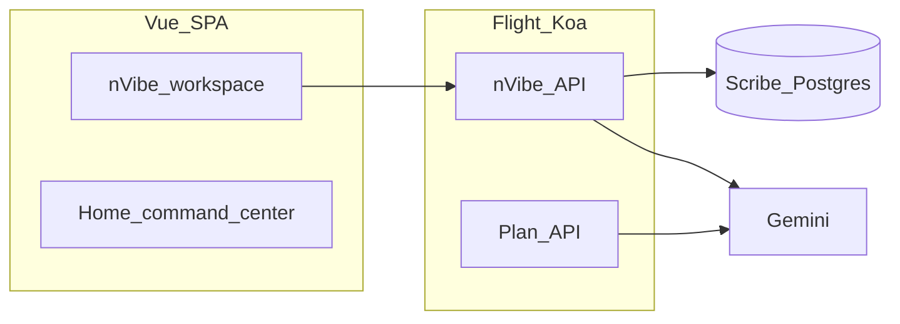

# nVibe · `vibe-to-aec-poc`

**nVibe** is an AI-native platform for **architecture, engineering, and construction (AEC)** — engineering-grade vibe coding for construction IT: **build**, **preview**, and **ship** full-stack software instead of disposable chat demos.

This repository is a **proof-of-concept monorepo** (Vue app, Slidev deck, shared branding). It contains **no production data**.

Tagline from our board narrative: *Vibe to production · Planned · built · shipped.*

---

<p align="center">
  <a href="https://ncircletech.com" title="nCircle Tech"></a>
  &nbsp;&nbsp;<span aria-hidden="true">·</span>&nbsp;&nbsp;
  <a href="https://www.thoughtpivot.com" title="ThoughtPivot"></a>
</p>

<p align="center"><strong>nCircle</strong> + <strong>ThoughtPivot</strong> — product and engineering partnership: enterprise AI platform delivery and the vibe-coding stack, led by <strong>nCircle</strong> with the ThoughtPivot bench.</p>

---

## Table of contents

- [Quick start](#quick-start)
- [At a glance](#at-a-glance)
- [Why nVibe exists](#why-nvibe-exists)
- [What nVibe is](#what-nvibe-is)
- [How this repository works](#how-this-repository-works)
- [Board slides (Slidev)](#board-slides-slidev)
- [Local development](#local-development)
  - [Prerequisites](#prerequisites)
  - [Ports and services](#ports-and-services)
  - [Install](#install)
  - [Environment variables](#environment-variables)
  - [Run commands](#run-commands)
  - [Tech stack in generated `App.vue`](#tech-stack-in-generated-appvue)
- [Troubleshooting](#troubleshooting)
- [Repository reference](#repository-reference)

---

## Quick start

1. **Clone** this repository and open a shell at the repo root.

2. **Use the expected Node version** (see [`.nvmrc`](.nvmrc)) and install dependencies:

   ```bash
   nvm use
   npm install
   ```

3. **Configure environment.** Copy [`.env.example`](.env.example) to **`.env`** at the repo root. Set at minimum:

   - **`GEMINI_API_KEY`** — from [Google AI Studio](https://aistudio.google.com/apikey) (Generative Language API enabled on the project).

   Scripts load `.env` via **`dotenv-cli`** where used.

4. **Start backing services** (Redis, Postgres, Scribe — see [Ports and services](#ports-and-services)):

   ```bash
   npm run start:docker
   ```

5. **Start the app** (Flight Koa + embedded Vite):

   ```bash
   npm run start:app
   ```

6. **Open the UI** at [http://localhost:3001](http://localhost:3001) (Vite dev server; Koa API defaults to port **3000** behind the proxy).

**Slides (optional):** In another terminal, `npm run start:slides` serves the board deck at [http://localhost:3030](http://localhost:3030). The nVibe dev server is pinned to **3001** with `strictPort` in [`app/vite.config.ts`](app/vite.config.ts) so it does not bump into **3030**.

---

## At a glance

This PoC is aimed at **AEC IT and innovation teams** who want **governed, brandable, full-stack** applications — not one-off chat artifacts. Running it locally, you get a working **nVibe workspace** backed by **Scribe** (persistence) and **Gemini** (chat and plan turns).

On first load, open **`/`** for the workspace: an apps rail, AI panel, **Preview** and **Code** tabs (Frontend, Backend, **Secrets** for per-app `bundles/<appId>/.env`), and materialized [`App.vue`](app/src/components/nvibe/viewer/generated/App.vue) / [`App.backend.ts`](app/src/components/nvibe/viewer/generated/App.backend.ts). If no apps exist yet, the UI creates a default app. Visit **`/home`** for the command-center style landing ([`Home.vue`](app/src/components/home/Home.vue)), aligned with the Slidev deck aesthetic.

---

## Why nVibe exists

- **Many “vibe” builders** are horizontal chat-to-app toys; few survive enterprise security, deployment, or lifecycle scrutiny.
- **Workflow-first tools** orchestrate steps across systems; they do not hand IT **owned, branded applications** customers run as first-class software.
- **Generic stacks** ignore AEC systems of record (for example Procore; Autodesk ACC / BIM 360–class environments), field realities, and IT operating models — “vertical AI” often stops at demos.
- **AEC IT** needs governance, tenancy, and deploy-under-your-cloud — or deals fail procurement.

## What nVibe is

- **AEC-native agents and integrations** — roadmap agents toward APIs and semantics buyers already use (third-party names are integration targets, not endorsements).
- **IT-owned delivery** — generation power for **IT and innovation teams**, with paths to deploy under customer clouds and identity estates.
- **Company-branded apps** — tenants ship experiences under their brand, not a generic vendor workflow canvas.
- **Git-native output** — generated code can live in **customer repositories** for security review before production.
- **Deploy anywhere** — customer cloud or edge where policy requires; no mandatory lock-in to a single SaaS landlord.
- **Full-stack apps** — Node/Vue applications with audit trails customers can run like other engineering assets — beyond simple workflow builders.

---

## How this repository works

### Routes and workspace

| Route | What you get |
| --- | --- |
| **`/`** | **nVibe workspace** — apps rail (multiple generated apps), resizable **AI** panel (Gemini chat and **Apply** when the model returns a valid Vue SFC), **Preview** (live iframe of the materialized app), and **Code** (edit `App.vue` and `App.backend.ts` with Apply). See [`Nvibe.vue`](app/src/components/nvibe/Nvibe.vue) and [`NvibeWorkspaceViewer.vue`](app/src/components/nvibe/viewer/NvibeWorkspaceViewer.vue). |
| **`/home`** | Command-center style landing — mirrors the product story and aesthetics used in the Slidev deck. See [`Home.vue`](app/src/components/home/Home.vue). |

### Preview, AI, and editing frontend vs backend

- **Preview** iframe loads the **active** app from a **per-app deployment bundle** under **`bundles/<appId>/`**: after **Apply** or app switch, the workspace runs **`vite build`** and starts **Flight in production** on **`http://127.0.0.1:4000`** (same port for static **`dist/`** and `App.backend.ts` APIs). [`generated/App.vue`](app/src/components/nvibe/viewer/generated/App.vue) mirrors the SFC for workspace tooling; **`viewer/generated/App.backend.ts` is not used** on the platform Flight (so per-app routes are not registered twice). Override the preview origin with **`VITE_NVIBE_BUNDLE_PREVIEW_ORIGIN`** if needed.
- **Bundle `App.vue` → `App.backend.ts`:** Use **base-relative** URLs for `fetch` (e.g. **`fetch(bundleApiUrl('api/nvibe-app/hello'))`** with [`templates/nvibe-bundle/src/bundleApi.ts`](templates/nvibe-bundle/src/bundleApi.ts), or `new URL('api/…', document.baseURI).href`). **Do not** use **`fetch('/api/…')`** with a leading slash in the Preview — the browser resolves that to the **workspace** `/api` proxy, not port **4000** (path-absolute URLs ignore `<base href>` in the dev iframe). Opening **`http://127.0.0.1:4000/`** directly in a tab is same-origin; leading-slash `/api/…` is fine there, but the helper keeps one pattern for both.
- **AI** uses Flight backends [`Nvibe.backend.ts`](app/src/components/nvibe/Nvibe.backend.ts) and [`Plan.backend.ts`](app/src/components/nvibe/ai/plan/Plan.backend.ts). Ideation-style prompts can yield **prose-only** replies (no fenced SFC → nothing to **Apply**); implementation-style turns can return a full **single-file Vue** fence you **Apply**. Optional **streaming**: `VITE_NVIBE_CHAT_STREAM=1` in `.env` enables SSE on `POST /api/nvibe/apps/:id/messages/stream`. **Chat behavior:** ideation steers informational turns away from fenced Vue; change requests can still return one full-SFC fence — there is no separate mode toggle in the UI.
- **Code** tab uses CodeMirror for the Vue SFC, backend module, and **Secrets** (dotenv text). Bundle env content is stored in **Scribe** on **Apply** (with the app row) and written to **`bundles/<appId>/.env`** — merged with repo-root **`SCRIBE_*`**, **`FLIGHT_REDIS_*`**, **`DATABASE_URL`**, **`FLIGHT_SESSION_DURATION_MS`**, **`FLIGHT_PAYLOAD_LIMIT`**, etc., plus enforced Flight keys for the bundle process. **Apply** restarts bundle Flight (full rebuild + reload). Treat Scribe backups as sensitive if Secrets contain keys. Payload limits are under [Troubleshooting](#troubleshooting).

### Persistence and architecture

**Scribe** (via Postgres) is the **source of truth**: tables `nvibe_app` and `nvibe_chat_message`. The **active** app’s `source`, `backendSource`, and optional **`bundleEnv`** (Secrets) are written to **`bundles/<appId>/`** (Vue SFC, `App.backend.ts`, `package.json`, `.env`, Vite scaffold from [`templates/nvibe-bundle/`](templates/nvibe-bundle/)). [`generated/App.vue`](app/src/components/nvibe/viewer/generated/App.vue) is a **mirror** for the workspace dev tree only. Bundle directories are **gitignored** (`/bundles/`). In development, **`SCRIBE_URL`** defaults to `http://127.0.0.1:1337` when unset; set it explicitly in production. **`GET /api/nvibe/apps/:id/source-revisions`** probes Scribe for row history when the Scribe version supports it.



Shared schemas live in [`shared/`](shared/). Flight discovers `app/src/**/*.backend.ts`. Root [`vite.config.ts`](vite.config.ts) re-exports [`app/vite.config.ts`](app/vite.config.ts) so Flight’s embedded Vite loads this app.

---

## Board slides (Slidev)

The **nVibe for AEC — nCircle Tech Board** deck is [`slides/slides.md`](slides/slides.md) (problem, positioning, competitive landscape, partnership, roadmap, economics, demo cue). Theming: [`slides/setup/main.ts`](slides/setup/main.ts), [`slides/styles/slides.css`](slides/styles/slides.css).

| Command | Description |
| --- | --- |
| `npm run start:slides` | Slidev at [http://localhost:3030](http://localhost:3030). |
| `npm run build:slides:pdf` | Export to [`docs/nvibe-board-slides.pdf`](docs/nvibe-board-slides.pdf) (see [`package.json`](package.json)). |

Design: [`branding/docs/guidelines.md`](branding/docs/guidelines.md), [`branding/docs/colors-and-type.md`](branding/docs/colors-and-type.md). Logos: [`branding/logos/SOURCES.md`](branding/logos/SOURCES.md).

---

## Local development

### Prerequisites

- **[nvm](https://github.com/nvm-sh/nvm)** (or another way to match [`.nvmrc`](.nvmrc)) and Node.js **Active LTS** (`nvm install --lts && nvm use`).
- **Docker** — recommended. [`compose.yml`](compose.yml) runs **Redis**, **Postgres**, and **Scribe** (`npm run start:docker`). Postgres credentials for the local stack: user / db / password **`vibe`**.
- **Google AI Studio** — an API key with Generative Language API enabled (see [Environment variables](#environment-variables)).

### Ports and services

| Service | Port (default) | Notes |
| --- | --- | --- |
| **Flight (Koa API)** | `FLIGHT_PORT` → **3000** | Browser hits **`/api`** via Vite proxy from **3001** in dev. |
| **Embedded Vite (UI)** | **3001** | Open [http://localhost:3001](http://localhost:3001). `strictPort` in [`app/vite.config.ts`](app/vite.config.ts). |
| **nVibe app bundle (preview)** | **4000** | Per-app Flight **production**: `vite build` + static **`dist/`** + `App.backend.ts` on one listener. Not running until you open **Apply** / load an app (supervisor in [`nvibeBundleRunner.ts`](app/src/components/nvibe/deploy/nvibeBundleRunner.ts)). |
| **Slidev** | **3030** | `npm run start:slides` — keep separate from Vite’s **3001**. |
| **Scribe** | **1337** | HTTP API; dev default `SCRIBE_URL` `http://127.0.0.1:1337`. Image: [`docker/scribe.Dockerfile`](docker/scribe.Dockerfile). |
| **Redis** | **6379** | Required by Flight (`FLIGHT_REDIS_*`). |
| **Postgres** | **5432** | Used by Scribe in Compose. |

### Install

```bash
nvm use
npm install
```

### Environment variables

Copy [`.env.example`](.env.example) to **`.env`** at the repo root. It documents every variable; below is the minimum and common tuning.

**Required for AI + Flight**

| Variable | Purpose |
| --- | --- |
| **`GEMINI_API_KEY`** | Gemini via `@google/genai` ([AI Studio key](https://aistudio.google.com/apikey), typically `AIza…`). |
| **`FLIGHT_REDIS_HOST`** / **`FLIGHT_REDIS_PORT`** | Redis for Flight (defaults in `.env.example`). |
| **`FLIGHT_MAX_WORKERS=1`** | **Keep for local dev** — avoids multiple embedded Vite instances exhausting ports. |
| **`FLIGHT_SESSION_DURATION_MS`** | e.g. **`86400000`** — avoids Flight “Invalid session duration” when unset. |

Also set **`FLIGHT_PORT`** if not using default **3000**; align **`VITE_FLIGHT_PORT`** with **`FLIGHT_PORT`** when used.

**Commonly set**

| Variable | Purpose |
| --- | --- |
| **`GEMINI_MODEL`** | Default in code / `.env.example` is **`gemini-3-flash-preview`**. Try **`gemini-3.1-pro-preview`** for heavier generations; use **`gemini-2.5-flash`** / **`gemini-2.5-pro`** if your key returns **`404`** on newer ids. |
| **`VITE_NVIBE_CHAT_STREAM`** | `1` or `true` → SSE on `POST /api/nvibe/apps/:id/messages/stream` (“Thinking…” + progress). Restart backend after change. |
| **`VITE_NVIBE_BUNDLE_PREVIEW_ORIGIN`** | Optional. Default **`http://127.0.0.1:4000`** — iframe **Preview** URL for the per-app bundle Flight (see [Routes and workspace](#routes-and-workspace)). |
| **`SCRIBE_URL`** | Required in **production**. Dev defaults **`http://127.0.0.1:1337`**. |
| **`FLIGHT_PAYLOAD_LIMIT`** | Raise (e.g. **`64mb`**) when saving very large `App.vue` via **`PUT`** — Koa default is often **`1mb`**. |
| **`NVIBE_APP_SOURCE_MAX_BYTES`** | App handler cap (default **50 MiB**, max **200 MiB** in code). |

**Full reference**

Commented templates, `VITE_PLAN_API_URL` pitfalls, `NVIBE_CHAT_*`, `NVIBE_IDEATION_*`, and optional GCP fields are in [`.env.example`](.env.example) — use it as the authoritative list.

The plan route uses [**`@google/genai`**](https://www.npmjs.com/package/@google/genai) with **`responseMimeType: application/json`** and **`responseJsonSchema`** from [`shared/planTurn.ts`](shared/planTurn.ts) ([Gemini structured outputs](https://ai.google.dev/gemini-api/docs/structured-output)). `npm run start:app` runs Node with **`--disable-warning=DEP0040`** (legacy `punycode` noise from dependencies).

### Run commands

| Command | Description |
| --- | --- |
| `npm run start:docker` | **`docker compose up -d`** — Redis **6379**, Postgres **5432**, Scribe **1337** ([`compose.yml`](compose.yml)). |
| `npm run start:app` | [**@spytech/flight**](https://www.npmjs.com/package/@spytech/flight) ([repo](https://github.com/ispyhumanfly/flight)): Koa on **`FLIGHT_PORT`** + embedded Vite on **3001**. |
| `npm run start:slides` | Slidev at **3030**. |
| `npm run typecheck` | `vue-tsc` + backend `tsc`. |
| `npm run build:app` | Production build → `app/dist` ([`app/vite.config.ts`](app/vite.config.ts)). |
| `npm run build:slides:pdf` | PDF export → [`docs/nvibe-board-slides.pdf`](docs/nvibe-board-slides.pdf). |
| `npm run nvibe:smoke` | [`scripts/nvibe-smoke.mjs`](scripts/nvibe-smoke.mjs) — diagnostics + nVibe API checks (default base **`http://127.0.0.1:3001`**; override **`NVIBE_SMOKE_BASE`**). |

Use `npm run start:app` and `npm run start:slides` (not `npm start app`).

### Tech stack in generated `App.vue`

Prompted UI should prefer: **Tailwind** utilities; **DaisyUI** semantic classes ([`app/src/style.css`](app/src/style.css)); icons via **`lucide-vue-next`**, **`@heroicons/vue`**, **`@phosphor-icons/vue`**, or **Iconify** / **`unplugin-icons`** (`import X from '~icons/collection/icon-id'`); **`@headlessui/vue`**; **`reka-ui`** / **`@/components/ui/*`** (shadcn-vue-style); **`vue-chartjs`** + **`chart.js`** (preview registers Chart.js). External “master prompts” may mention Chart.js CDN — in-repo mapping: [`docs/nvibe-master-prompt-dialect.md`](docs/nvibe-master-prompt-dialect.md).

---

## Troubleshooting

### Plan service unavailable

If chat shows a **template reply** with “Plan service unavailable”, read the italic line:

- **`Failed to fetch`** — Flight not running, Redis down, or wrong host.
- **`404 — Not Found`** — almost never Gemini. Typical causes: **`VITE_PLAN_API_URL=http://127.0.0.1:3001`** (requests **`…/plan`** on **Vite**, not Koa → 404). **Fix:** leave **`VITE_PLAN_API_URL`** unset so the app uses **`/api/plan`**, or set **`http://127.0.0.1:3000`** (Koa / **`FLIGHT_PORT`**), or **`http://127.0.0.1:3001/api`** to hit the Vite proxy. Align **`PLAN_API_PORT`** with **`FLIGHT_PORT`** (or remove **`PLAN_API_PORT`**) so [`app/vite.config.ts`](app/vite.config.ts) proxies `/api` to the port Koa listens on.

### Gemini / Google API (`502`, `403`, `404`, `429`)

- **`502`** — Koa reached Google but the call failed.
- **`403`** — almost always **auth / project / model access**, not your Vue code: enable **Generative Language API**, check billing / region.
- **`GEMINI_MODEL`** — default in code and [`.env.example`](.env.example) is **`gemini-3-flash-preview`** ([Gemini models](https://ai.google.dev/gemini-api/docs/models)). **`GEMINI_API_KEY` must be an AI Studio API key** (`AIza…`). Long **`AQ.…`** tokens are the wrong credential type.
- **`404`** on the model id — switch to **`gemini-2.5-flash`** or **`gemini-2.5-pro`**, or confirm model availability for your project.
- **`429`** — quota / rate limits; retry later or check AI Studio / GCP usage.

### nVibe chat: `404` on `/api/nvibe/apps/…/messages`

Platform Flight loads `*.backend.ts` with **`require()` in the worker** — **backends do not hot-reload**. After pulling or editing [`Nvibe.backend.ts`](app/src/components/nvibe/Nvibe.backend.ts), **restart `npm run start:app`**. A stale worker often returns **`Not Found`** for newer routes while **`GET /api/nvibe/apps`** still works. The UI surfaces a hint ([`nvibeAppApi.ts`](app/src/components/nvibe/apps/nvibeAppApi.ts)). **Per-app** `App.backend.ts` is restarted when you **Apply** (bundle Flight on port **4000**).

### Per-app bundle: `App.vue` cannot reach `App.backend.ts` (404 / wrong JSON / “CORS”)

Usually **not** CORS — bundle Flight enables **`koa/cors`** by default; SPA and API share **:4000**. Typical cause is **`fetch('/api/…')`** from the **workspace Preview** iframe: that hits **platform** Koa, not bundle Flight. Use **`bundleApiUrl('api/nvibe-app/…')`** from [`templates/nvibe-bundle/src/bundleApi.ts`](templates/nvibe-bundle/src/bundleApi.ts) or base-relative URLs as in [Preview, AI, and editing frontend vs backend](#preview-ai-and-editing-frontend-vs-backend). Confirm routes live under **`/api/nvibe-app/*`** in **`App.backend.ts`**.

### nVibe preview: blank iframe or connection errors on port 4000

Ensure **`npm run start:docker`** has Redis/Postgres/Scribe up. Each bundle’s **`.env`** includes **`FLIGHT_REDIS_*`** and **`SCRIBE_URL`** (from repo-root `.env` + defaults) so bundle Flight matches the workspace stack; adjust **`bundles/<appId>/.env`** per app if paths differ. First **Apply** runs **`npm install`** in the bundle directory — it can take a minute. Check **[`GET /api/nvibe/diagnostics`](app/src/components/nvibe/Nvibe.backend.ts)** for **`nvibeBundleDir`** and errors in the terminal where **`npm run start:app`** runs.

### Materialize + Scribe

- **`GET /api/nvibe/diagnostics`** — no Scribe required; returns `process.cwd()`, **`resolvedRepoRoot`**, `generatedDir`, paths to materialized `App.vue` / `App.backend.ts`, existence flags, Scribe config. Use when files are missing or wrong tree (**`NVIBE_REPO_ROOT`** / **`REPO_ROOT`** → repo root if needed).
- **`npm run nvibe:smoke`** — diagnostics + list apps + one app + messages; needs **`npm run start:docker`** and **`npm run start:app`**.

### Large `App.vue` / Code tab

Saving a very large `source` needs a **large JSON body** on **`PUT /api/nvibe/apps/:id`**. Raise **`FLIGHT_PAYLOAD_LIMIT`** (e.g. **`64mb`**). Handler cap: **`NVIBE_APP_SOURCE_MAX_BYTES`** (default **50 MiB**, max **200 MiB**); see [`.env.example`](.env.example).

### Cursor browser console noise

Messages like **`[CursorBrowser] Native dialog overrides installed`** come from **Cursor’s in-IDE browser automation**, not this repo’s runtime.

---

## Repository reference

| Area | Location |
| --- | --- |
| Vue app | [`app/`](app/) — Tailwind + shadcn-vue; nVibe **`/`**, landing **`/home`** |
| nVibe HTTP API | [`Nvibe.backend.ts`](app/src/components/nvibe/Nvibe.backend.ts) — **`/api/nvibe/apps`** (CRUD), **`…/messages`**, **`…/source-revisions`**. **Scribe is source of truth**; active app written to **`bundles/<appId>/`** + **`generated/App.vue`** mirror; bundle Flight restart via [`nvibeBundleRunner.ts`](app/src/components/nvibe/deploy/nvibeBundleRunner.ts). Successful **PUT** sets **`active`** when needed; AI **Apply** then **PATCH**es **`applied`**. Dev: [`nvibeAppApi.ts`](app/src/components/nvibe/apps/nvibeAppApi.ts) uses same-origin **`/api/...`** ( **`VITE_KOA_ORIGIN`** only if bypassing proxy). |
| Plan API | [`Plan.backend.ts`](app/src/components/nvibe/ai/plan/Plan.backend.ts) — `POST /plan`, `/api/plan`, health, Gemini + Zod |
| Shared schemas | [`shared/`](shared/) |
| Compose | [`compose.yml`](compose.yml) |
| Vite entry | [`vite.config.ts`](vite.config.ts) → [`app/vite.config.ts`](app/vite.config.ts) |
| Slides | [`slides/`](slides/) |
| Branding | [`branding/`](branding/) — tokens, logos, guidelines |
