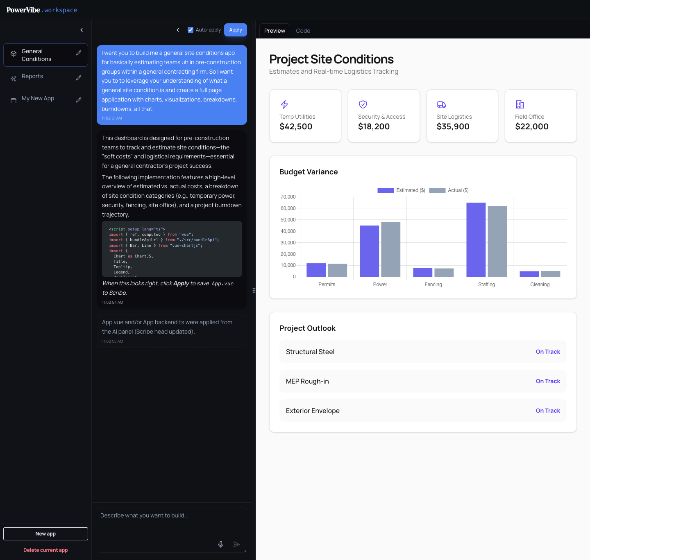
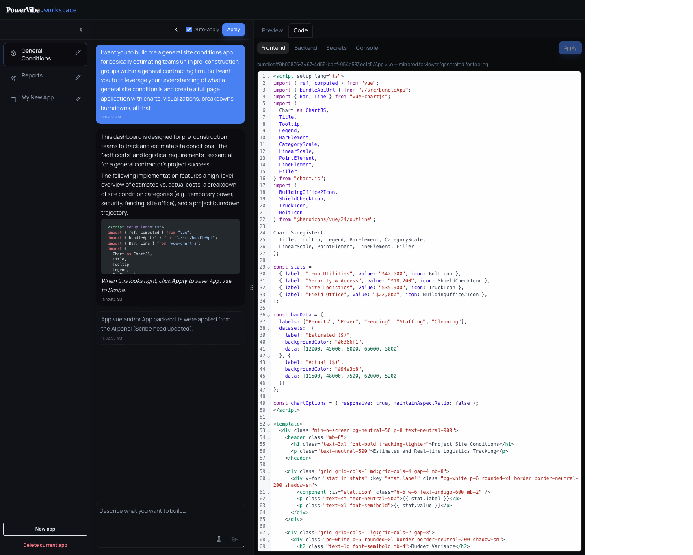
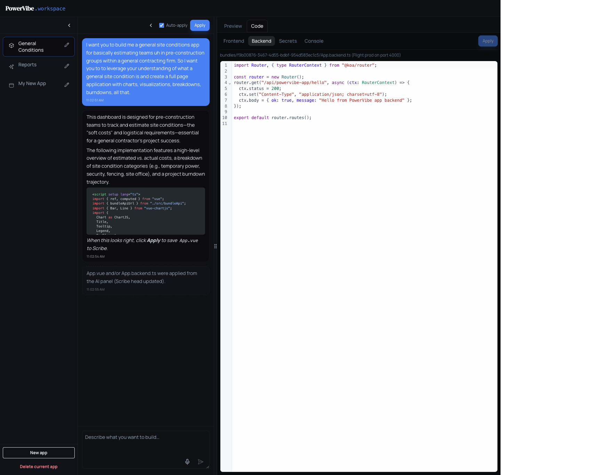
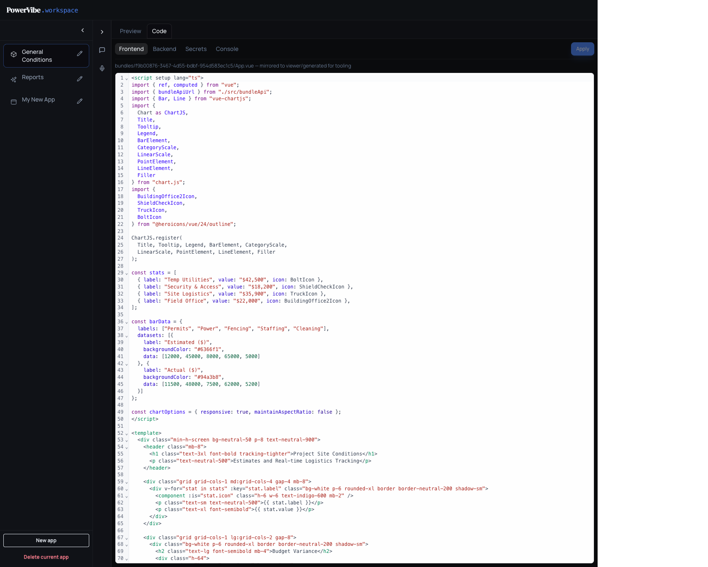
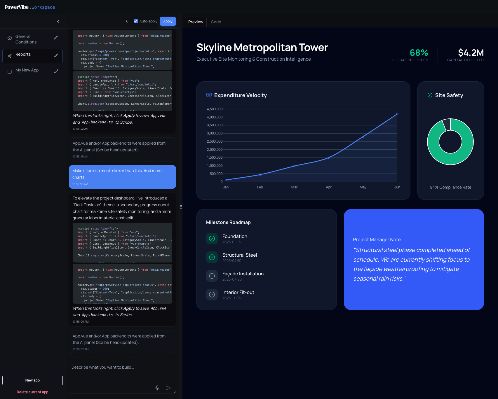
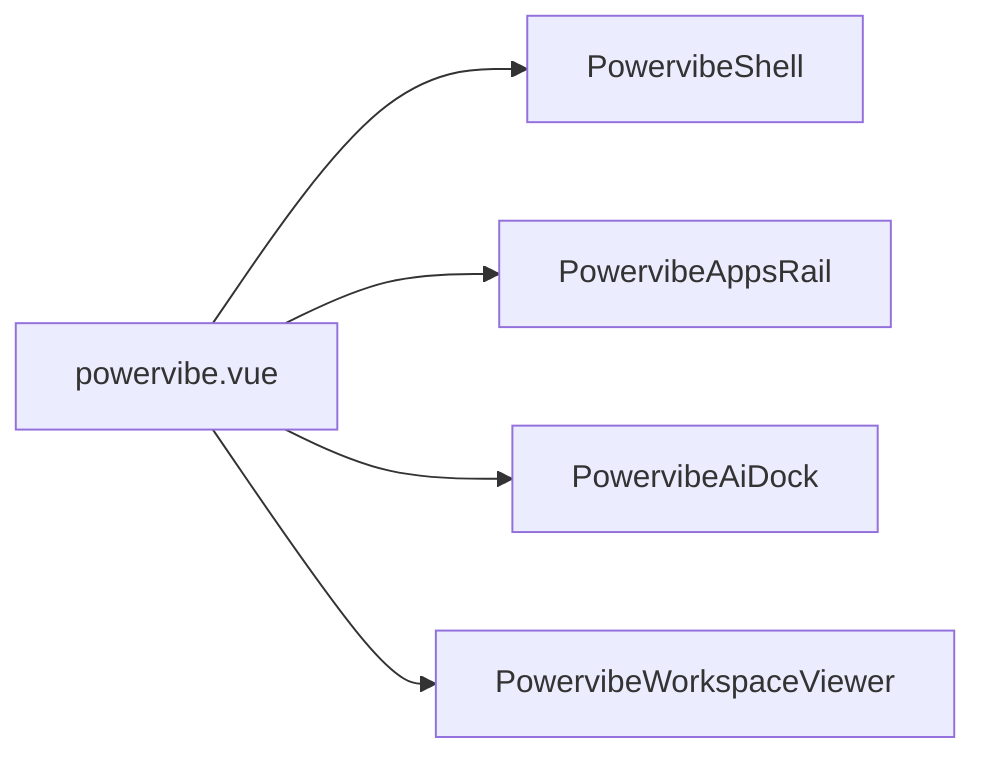
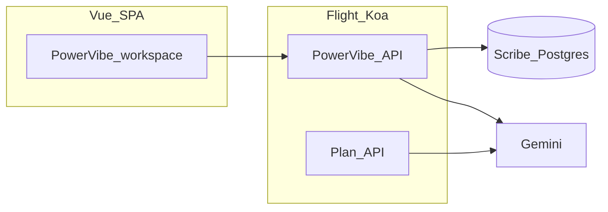

# PowerVibe

**PowerVibe** is ThoughtPivot’s **vibe coding engine**: a **starting-point framework** for building **real** vibe coding platforms—not a throwaway demo. Fork this repository, run it on ThoughtPivot’s stack, and extend it with **authentication**, **tenancy**, **billing**, and **custom connectors** so your users’ AI-assisted builders can reach the APIs, data stores, and tools you choose.

**ThoughtPivot runtime (what this engine sits on)**

- **[Flight](https://www.npmjs.com/package/@spytech/flight)** — Koa-based application server, embedded Vite for the workspace UI, Redis-backed sessions, and discovery of colocated `***.backend.ts`** modules for HTTP APIs.
- **Scribe + PostgreSQL** — Scribe is ThoughtPivot’s persistence layer over **Postgres** (apps, chat history, revisions); the workspace reads and writes through Scribe’s HTTP API, not ad hoc SQL from the Vue app.
- **Gemini** — chat, optional streaming, structured **plan** turns, and voice transcription for the AI panel (bring your own keys and model policy).

Together, that stack turns prompts into **durable, reviewable, deployable** Vue + Flight artifacts instead of disposable chat snippets.

Think in **two layers**:

1. **The engine (this repository)** — workspace chrome, Scribe-backed models, Flight routes (`/api/powervibe/...`, `/api/plan`), Gemini orchestration, materialization into `[templates/powervibe-bundle/](templates/powervibe-bundle/)`, and preview supervision on **bundle Flight** (`**:4000`**). These pieces are **generic and white-label friendly**: you are not rebuilding chat-to-repo pipelines for every vertical.
2. **Generated vibe environments (each app in the rail)** — each row is its **own** Vue + Flight bundle: dashboards, internal tools, **customer-facing products**—whatever your platform needs—each inheriting the engine’s **plan → preview → ship** loop while staying **brandable** and **Git-native**.

**This monorepo** is ThoughtPivot’s **baseline workspace UI** (Vue), optional Slidev narrative deck, and shared branding tokens—meant to be **cloned or forked** and carried forward. PowerVibe is the **framework**; you layer **identity**, **governance**, and **integrations** for your product.

Tagline from our board narrative: *Vibe to production · Planned · built · shipped.*

---

**ThoughtPivot** — product and engineering for the vibe-to-production stack and enterprise AI delivery.  
**PowerVibe** is ThoughtPivot’s vibe coding engine.

---

## Table of contents

- [Quick start](#quick-start)
- [At a glance](#at-a-glance)
- [Fork and extend](#fork-and-extend)
- [Screenshots](#screenshots)
- [Why PowerVibe exists](#why-powervibe-exists)
- [What PowerVibe is](#what-powervibe-is)
- [How this repository works](#how-this-repository-works)
  - [Routes and workspace](#routes-and-workspace)
  - [App workspace layout](#app-workspace-layout)
  - [Architecture diagrams](#architecture-diagrams)
  - [Preview, AI, and editing frontend vs backend](#preview-ai-and-editing-frontend-vs-backend)
  - [Persistence and architecture](#persistence-and-architecture)
- [Board slides (Slidev)](#board-slides-slidev)
- [Local development](#local-development)
  - [Prerequisites](#prerequisites)
  - [Ports and services](#ports-and-services)
  - [Install](#install)
  - [Environment variables](#environment-variables)
  - [Run commands](#run-commands)
  - [Tech stack in generated `App.vue](#tech-stack-in-generated-appvue)`
- [Troubleshooting](#troubleshooting)
- [Repository reference](#repository-reference)

---

## Quick start

1. **Clone** this repository (`git clone https://github.com/thoughtpivot/powervibe.git`) and open a shell at the repo root.
2. **Use the expected Node version** (see `[.nvmrc](.nvmrc)`) and install dependencies:
  ```bash
   nvm use
   npm install
  ```
3. **Configure environment.** Copy `[.env.example](.env.example)` to `**.env`** at the repo root. Set at minimum:
  - `**GEMINI_API_KEY`** — from [Google AI Studio](https://aistudio.google.com/apikey) (Generative Language API enabled on the project).
   Scripts load `.env` via `**dotenv-cli**` where used.
4. **Start backing services** (Redis, Postgres, Scribe — see [Ports and services](#ports-and-services)):
  ```bash
   npm run start:docker
  ```
5. **Start the app** (ThoughtPivot **Flight**: Koa + embedded Vite):
  ```bash
   npm run start:app
  ```
6. **Open the UI** at [http://localhost:3001](http://localhost:3001) (Vite dev server; Koa API defaults to port **3000** behind the proxy).

**Slides (optional):** In another terminal, `npm run start:slides` serves the board deck at [http://localhost:3030](http://localhost:3030). The PowerVibe dev server is pinned to **3001** with `strictPort` in `[app/vite.config.ts](app/vite.config.ts)` so it does not bump into **3030**.

---

## At a glance

PowerVibe is for **product and platform teams** (and **partners** white-labeling ThoughtPivot) who want **governed, brandable, full-stack** vibe coding surfaces—not one-off chat artifacts. Running it locally, you get a working **PowerVibe workspace** on **Flight**, with **Scribe → Postgres** for durable app and chat state and **Gemini** for model turns.

On first load, `**/`** is the workspace: an apps rail, AI panel, **Preview** and **Code** tabs (Frontend, Backend, **Secrets** for per-app `bundles/<appId>/.env`), and materialized `[App.vue](app/src/components/powervibe/viewer/generated/App.vue)` / `[App.backend.ts](app/src/components/powervibe/viewer/generated/App.backend.ts)`. If no apps exist yet, the UI creates a default app.

## Fork and extend

Treat this repository as a **baseline you own after fork**: the workspace, APIs, bundle template, and migrations are the **spine** of a vibe coding platform; everything else is product decisions.

- **Authentication and tenancy** — Flight already expects Redis and session configuration; add your IdP, organizations, and row-level policy around Scribe (or your own service layer) as you harden for production.
- **Custom connectors** — expose enterprise systems, data planes, or SaaS APIs to your builders: new Flight backends, tool-calling contracts, or UI affordances alongside the existing AI panel are all compatible with the same **materialize → preview → ship** loop.
- **Branding and packaging** — replace tokens and shell chrome; keep the engine boundaries (workspace ↔ Scribe ↔ bundle Flight) or refactor them deliberately.

You are not locked into a single vendor canvas: **Git-native** bundles and **customer-managed** Postgres/Redis/keys remain first-class.

---

## Screenshots

Local UI at **[http://localhost:3001](http://localhost:3001)** after `npm run start:docker` and `npm run start:app`. PNGs live in [`docs/screenshots/`](docs/screenshots/) — **commit and push them** so GitHub (and other hosts) render images from the default branch.

Captures below use **real apps** in the rail (**General Conditions**, **Reports**) with bundle Preview running on Flight **:4000**.

| Preview tab | Code tab |
| --- | --- |
|  |  |

| AI panel expanded | AI panel collapsed |
| --- | --- |
|  |  |

| Workspace overview |
| --- |
|  |


---

## Why PowerVibe exists

- **Many “vibe” builders** are horizontal chat-to-app toys; few survive enterprise security, deployment, or lifecycle scrutiny.
- **Workflow-first tools** orchestrate steps across systems; they do not hand teams **owned, branded applications** that run as first-class software.
- **Prompt-only demos** rarely connect to durable state, reviewable code, and repeatable deploy paths — “vertical AI” slides often stop before production handoff.
- **Enterprise buyers** need governance, tenancy, and deploy-under-your-cloud — or deals fail procurement.
- **Teams that outgrow a single chat pane** still need an **engine**: multi-app tenancy, revision-friendly sources, preview isolation, and APIs they can wrap—not a one-off canvas locked to one vendor.

## What PowerVibe is

- **Vibe coding engine** — reusable workspace shell, persistence, AI routing, bundle lifecycle, and preview runtime so you can ship **richer vibe coding environments** without reimplementing the full stack each time.
- **Prompt-native app creation** — natural language and structured turns drive UI and backend artifacts partners can specialize for their domains.
- **Partner-owned delivery** — generation power for **internal builders and GSIs**, with paths to deploy under customer clouds and identity estates.
- **White-label surfaces** — ship experiences under **your** brand; swap ThoughtPivot’s default chrome and tokens for yours after fork.
- **Git-native output** — generated code can live in **customer repositories** for security review before production.
- **Governed environments** — Scribe-backed apps and chat (`powervibe_app`, `powervibe_chat_message`), optional **SSE** streaming (`VITE_POWERVIBE_CHAT_STREAM`), and **voice → transcript → send** via Gemini (`[geminiTranscribeAudio.ts](app/src/components/powervibe/ai/geminiTranscribeAudio.ts)`) for field-style input.
- **Deploy anywhere** — customer cloud or edge where policy requires; no mandatory lock-in to a single SaaS landlord.
- **Full-stack apps** — Node/Vue applications with audit trails teams can run like other engineering assets — beyond simple workflow builders.

---

## How this repository works

### Routes and workspace


| Route   | What you get                                                                                                                                                                                                                                                                                                                                                                                                                                          |
| ------- | ----------------------------------------------------------------------------------------------------------------------------------------------------------------------------------------------------------------------------------------------------------------------------------------------------------------------------------------------------------------------------------------------------------------------------------------------------- |
| `**/`** | **PowerVibe workspace** — apps rail (multiple generated apps), resizable **AI** panel (Gemini chat and **Apply** when the model returns a valid Vue SFC), **Preview** (live iframe of the materialized app), and **Code** (edit `App.vue` and `App.backend.ts` with Apply). See `[powervibe.vue](app/src/components/powervibe/powervibe.vue)` and `[PowervibeWorkspaceViewer.vue](app/src/components/powervibe/viewer/PowervibeWorkspaceViewer.vue)`. |


### App workspace layout

The SPA mounts **only** PowerVibe (`[app/src/router/index.ts](app/src/router/index.ts)`). Composition starts at `[powervibe.vue](app/src/components/powervibe/powervibe.vue)`. Feature code is grouped under `[app/src/components/powervibe/](app/src/components/powervibe/)`.


| Area                                                                                                                                         | Role                                                                      |
| -------------------------------------------------------------------------------------------------------------------------------------------- | ------------------------------------------------------------------------- |
| `[shell/](app/src/components/powervibe/shell/)`, `[PowervibeWorkspaceLayout.vue](app/src/components/powervibe/PowervibeWorkspaceLayout.vue)` | Header chrome and grid layout                                             |
| `[apps/](app/src/components/powervibe/apps/)`                                                                                                | Apps rail, REST client, Scribe app repository, icons                      |
| `[ai/](app/src/components/powervibe/ai/)`                                                                                                    | AI dock, prompt panel, plan + ideation, chat repositories, Gemini helpers |
| `[viewer/](app/src/components/powervibe/viewer/)`                                                                                            | Preview iframe, CodeMirror editors, materialization, bundle URL helpers   |
| `[deploy/](app/src/components/powervibe/deploy/)`                                                                                            | Bundle write, Flight runner, env merge, console log hub                   |


### Architecture diagrams

**Product vs engine vs generated apps**


**Apply / preview path (simplified)**


**Vue composition root**




### Preview, AI, and editing frontend vs backend

- **Preview** iframe loads the **active** app from a **per-app deployment bundle** under `**bundles/<appId>/`**: after Apply or app switch, the workspace runs `**vite build`** and starts **Flight in production** on `**http://127.0.0.1:4000`** (same port for static `**dist/`** and `App.backend.ts` APIs). `[generated/App.vue](app/src/components/powervibe/viewer/generated/App.vue)` mirrors the SFC for workspace tooling; `**viewer/generated/App.backend.ts` is not used** on the platform Flight (so per-app routes are not registered twice). Override the preview origin with `**VITE_POWERVIBE_BUNDLE_PREVIEW_ORIGIN`** if needed.
- **Bundle `App.vue` → `App.backend.ts`:** Use **base-relative** URLs for `fetch` (e.g. `**fetch(bundleApiUrl('api/powervibe-app/hello'))`** with `[templates/powervibe-bundle/src/bundleApi.ts](templates/powervibe-bundle/src/bundleApi.ts)`, or `new URL('api/…', document.baseURI).href`). **Do not** use `**fetch('/api/…')`** with a leading slash in the Preview — the browser resolves that to the **workspace** `/api` proxy, not port **4000** (path-absolute URLs ignore `<base href>` in the dev iframe). Opening `**http://127.0.0.1:4000/`** directly in a tab is same-origin; leading-slash `/api/…` is fine there, but the helper keeps one pattern for both.
- **AI** uses Flight backends `[Powervibe.backend.ts](app/src/components/powervibe/Powervibe.backend.ts)` and `[Plan.backend.ts](app/src/components/powervibe/ai/plan/Plan.backend.ts)`. Ideation-style prompts can yield **prose-only** replies (no fenced SFC → nothing to **Apply**); implementation-style turns can return a full **single-file Vue** fence you **Apply**. Optional **streaming**: `VITE_POWERVIBE_CHAT_STREAM=1` in `.env` enables SSE on `POST /api/powervibe/apps/:id/messages/stream`. **Chat behavior:** ideation steers informational turns away from fenced Vue; change requests can still return one full-SFC fence — there is no separate mode toggle in the UI.
- **Code** tab uses CodeMirror for the Vue SFC, backend module, and **Secrets** (dotenv text). Bundle env content is stored in **Scribe** on **Apply** (with the app row) and written to `**bundles/<appId>/.env`** — merged with repo-root `**SCRIBE_*`**, `**FLIGHT_REDIS_***`, `**DATABASE_URL**`, `**FLIGHT_SESSION_DURATION_MS**`, `**FLIGHT_PAYLOAD_LIMIT**`, etc., plus enforced Flight keys for the bundle process. **Apply** restarts bundle Flight (full rebuild + reload). Treat Scribe backups as sensitive if Secrets contain keys. Payload limits are under [Troubleshooting](#troubleshooting).

### Persistence and architecture

**ThoughtPivot Scribe** (HTTP API over **Postgres**) is the **source of truth**: tables `**powervibe_app`** and `**powervibe_chat_message`**. The **active** app’s `source`, `backendSource`, and optional `**bundleEnv`** (Secrets) are written to `**bundles/<appId>/`** (Vue SFC, `App.backend.ts`, `package.json`, `.env`, Vite scaffold from `[templates/powervibe-bundle/](templates/powervibe-bundle/)`). `[generated/App.vue](app/src/components/powervibe/viewer/generated/App.vue)` is a **mirror** for the workspace dev tree only. Bundle directories are **gitignored** (`/bundles/`). In development, `**SCRIBE_URL`** defaults to `http://127.0.0.1:1337` when unset; set it explicitly in production. `**GET /api/powervibe/apps/:id/source-revisions`** probes Scribe for row history when the Scribe version supports it. **DDL:** see `[migrations/README.md](migrations/README.md)`.

**Platform request path (dev)**




Shared schemas live in `[shared/](shared/)`. Flight discovers `app/src/**/*.backend.ts`. Root `[vite.config.ts](vite.config.ts)` re-exports `[app/vite.config.ts](app/vite.config.ts)` so Flight’s embedded Vite loads this app.

---

## Board slides (Slidev)

The **PowerVibe · ThoughtPivot VibeCoding** board deck is `[slides/slides.md](slides/slides.md)` (problem, positioning, competitive landscape, partnership, roadmap, economics, talk track). Theming: `[slides/setup/main.ts](slides/setup/main.ts)`, `[slides/styles/slides.css](slides/styles/slides.css)`.


| Command                    | Description                                                                                                          |
| -------------------------- | -------------------------------------------------------------------------------------------------------------------- |
| `npm run start:slides`     | Slidev at [http://localhost:3030](http://localhost:3030).                                                            |
| `npm run build:slides:pdf` | Export to `[docs/powervibe-board-slides.pdf](docs/powervibe-board-slides.pdf)` (see `[package.json](package.json)`). |


Design: `[branding/docs/guidelines.md](branding/docs/guidelines.md)`, `[branding/docs/colors-and-type.md](branding/docs/colors-and-type.md)`. Logos: `[branding/logos/SOURCES.md](branding/logos/SOURCES.md)`.

---

## Local development

### Prerequisites

- **[nvm](https://github.com/nvm-sh/nvm)** (or another way to match `[.nvmrc](.nvmrc)`) and Node.js **Active LTS** (`nvm install --lts && nvm use`).
- **Docker** — recommended. `[compose.yml](compose.yml)` runs **Redis**, **Postgres**, and **Scribe** (`npm run start:docker`). Postgres credentials for the local stack: user / db / password `**vibe`**.
- **Google AI Studio** — an API key with Generative Language API enabled (see [Environment variables](#environment-variables)).

### Ports and services


| Service                            | Port (default)           | Notes                                                                                                                                                                                                                                                               |
| ---------------------------------- | ------------------------ | ------------------------------------------------------------------------------------------------------------------------------------------------------------------------------------------------------------------------------------------------------------------- |
| **Flight (Koa API)**               | `FLIGHT_PORT` → **3000** | Browser hits `**/api`** via Vite proxy from **3001** in dev.                                                                                                                                                                                                        |
| **Embedded Vite (UI)**             | **3001**                 | Open [http://localhost:3001](http://localhost:3001). `strictPort` in `[app/vite.config.ts](app/vite.config.ts)`.                                                                                                                                                    |
| **PowerVibe app bundle (preview)** | **4000**                 | Per-app Flight **production**: `vite build` + static `**dist/`** + `App.backend.ts` on one listener. Not running until you open **Apply** / load an app (supervisor in `[powervibeBundleRunner.ts](app/src/components/powervibe/deploy/powervibeBundleRunner.ts)`). |
| **Slidev**                         | **3030**                 | `npm run start:slides` — keep separate from Vite’s **3001**.                                                                                                                                                                                                        |
| **Scribe**                         | **1337**                 | HTTP API; dev default `SCRIBE_URL` `http://127.0.0.1:1337`. Image: `[docker/scribe.Dockerfile](docker/scribe.Dockerfile)`.                                                                                                                                          |
| **Redis**                          | **6379**                 | Required by Flight (`FLIGHT_REDIS_`*).                                                                                                                                                                                                                              |
| **Postgres**                       | **5432**                 | Used by Scribe in Compose.                                                                                                                                                                                                                                          |


### Install

```bash
nvm use
npm install
```

### Environment variables

Copy `[.env.example](.env.example)` to `**.env**` at the repo root. It documents every variable; below is the minimum and common tuning.

**Required for AI + Flight**


| Variable                                          | Purpose                                                                                              |
| ------------------------------------------------- | ---------------------------------------------------------------------------------------------------- |
| `**GEMINI_API_KEY`**                              | Gemini via `@google/genai` ([AI Studio key](https://aistudio.google.com/apikey), typically `AIza…`). |
| `**FLIGHT_REDIS_HOST`** / `**FLIGHT_REDIS_PORT**` | Redis for Flight (defaults in `.env.example`).                                                       |
| `**FLIGHT_MAX_WORKERS=1**`                        | **Keep for local dev** — avoids multiple embedded Vite instances exhausting ports.                   |
| `**FLIGHT_SESSION_DURATION_MS`**                  | e.g. `**86400000`** — avoids Flight “Invalid session duration” when unset.                           |


Also set `**FLIGHT_PORT**` if not using default **3000**; align `**VITE_FLIGHT_PORT`** with `**FLIGHT_PORT`** when used.

**Commonly set**


| Variable                                   | Purpose                                                                                                                                                                                                                   |
| ------------------------------------------ | ------------------------------------------------------------------------------------------------------------------------------------------------------------------------------------------------------------------------- |
| `**GEMINI_MODEL`**                         | Default in code / `.env.example` is `**gemini-3-flash-preview`**. Try `**gemini-3.1-pro-preview**` for heavier generations; use `**gemini-2.5-flash**` / `**gemini-2.5-pro**` if your key returns `**404**` on newer ids. |
| `**VITE_POWERVIBE_CHAT_STREAM**`           | `1` or `true` → SSE on `POST /api/powervibe/apps/:id/messages/stream` (“Thinking…” + progress). Restart backend after change.                                                                                             |
| `**VITE_POWERVIBE_BUNDLE_PREVIEW_ORIGIN**` | Optional. Default `**http://127.0.0.1:4000**` — iframe **Preview** URL for the per-app bundle Flight (see [Routes and workspace](#routes-and-workspace)).                                                                 |
| `**SCRIBE_URL`**                           | Required in **production**. Dev defaults `**http://127.0.0.1:1337`**.                                                                                                                                                     |
| `**FLIGHT_PAYLOAD_LIMIT`**                 | Raise (e.g. `**64mb**`) when saving very large `App.vue` via `**PUT**` — Koa default is often `**1mb**`.                                                                                                                  |
| `**POWERVIBE_APP_SOURCE_MAX_BYTES**`       | App handler cap (default **50 MiB**, max **200 MiB** in code).                                                                                                                                                            |


**Full reference**

Commented templates, `VITE_PLAN_API_URL` pitfalls, `POWERVIBE_CHAT_*`, `POWERVIBE_IDEATION_*`, and optional GCP fields are in `[.env.example](.env.example)` — use it as the authoritative list.

The plan route uses `**[@google/genai](https://www.npmjs.com/package/@google/genai)`** with `**responseMimeType: application/json`** and `**responseJsonSchema**` from `[shared/planTurn.ts](shared/planTurn.ts)` ([Gemini structured outputs](https://ai.google.dev/gemini-api/docs/structured-output)). `npm run start:app` runs Node with `**--disable-warning=DEP0040**` (legacy `punycode` noise from dependencies).

### Run commands


| Command                    | Description                                                                                                                                                                        |
| -------------------------- | ---------------------------------------------------------------------------------------------------------------------------------------------------------------------------------- |
| `npm run start:docker`     | `**docker compose up -d**` — Redis **6379**, Postgres **5432**, Scribe **1337** (`[compose.yml](compose.yml)`).                                                                    |
| `npm run start:app`        | **[@spytech/flight](https://www.npmjs.com/package/@spytech/flight)** ([repo](https://github.com/ispyhumanfly/flight)): Koa on `**FLIGHT_PORT`** + embedded Vite on **3001**.       |
| `npm run start:slides`     | Slidev at **3030**.                                                                                                                                                                |
| `npm run typecheck`        | `vue-tsc` + backend `tsc`.                                                                                                                                                         |
| `npm run build:app`        | Production build → `app/dist` (`[app/vite.config.ts](app/vite.config.ts)`).                                                                                                        |
| `npm run build:slides:pdf` | PDF export → `[docs/powervibe-board-slides.pdf](docs/powervibe-board-slides.pdf)`.                                                                                                 |
| `npm run powervibe:smoke`  | `[scripts/powervibe-smoke.mjs](scripts/powervibe-smoke.mjs)` — diagnostics + PowerVibe API checks (default base `**http://127.0.0.1:3001`**; override `**POWERVIBE_SMOKE_BASE`**). |


Use `npm run start:app` and `npm run start:slides` (not `npm start app`).

### Tech stack in generated `App.vue`

Prompted UI should prefer: **Tailwind** utilities; **DaisyUI** semantic classes (`[app/src/style.css](app/src/style.css)`); icons via `**lucide-vue-next`**, `**@heroicons/vue`**, `**@phosphor-icons/vue**`, or Iconify / `**unplugin-icons**` (`import X from '~icons/collection/icon-id'`); `**@headlessui/vue**`; `**reka-ui**` / `**@/components/ui/***` (shadcn-vue-style); `**vue-chartjs**` + `**chart.js**` (preview registers Chart.js). External “master prompts” may mention Chart.js CDN — in-repo mapping: `[docs/powervibe-master-prompt-dialect.md](docs/powervibe-master-prompt-dialect.md)`.

---

## Troubleshooting

### Plan service unavailable

If chat shows a **template reply** with “Plan service unavailable”, read the italic line:

- `**Failed to fetch`** — Flight not running, Redis down, or wrong host.
- `**404 — Not Found`** — almost never Gemini. Typical causes: `**VITE_PLAN_API_URL=http://127.0.0.1:3001**` (requests `**…/plan**` on **Vite**, not Koa → 404). **Fix:** leave `**VITE_PLAN_API_URL`** unset so the app uses `**/api/plan`**, or set `**http://127.0.0.1:3000**` (Koa / `**FLIGHT_PORT**`), or `**http://127.0.0.1:3001/api**` to hit the Vite proxy. Align `**PLAN_API_PORT**` with `**FLIGHT_PORT**` (or remove `**PLAN_API_PORT**`) so `[app/vite.config.ts](app/vite.config.ts)` proxies `**/api**` to the port Koa listens on **without stripping the `/api` prefix** (Flight backends register `**/api/powervibe/...`** and `**/api/plan`**).

### Gemini / Google API (`502`, `403`, `404`, `429`)

- `**502**` — Koa reached Google but the call failed.
- `**403**` — almost always **auth / project / model access**, not your Vue code: enable **Generative Language API**, check billing / region.
- `**GEMINI_MODEL`** — default in code and `[.env.example](.env.example)` is `**gemini-3-flash-preview`** ([Gemini models](https://ai.google.dev/gemini-api/docs/models)). `**GEMINI_API_KEY` must be an AI Studio API key** (`AIza…`). Long `**AQ.…`** tokens are the wrong credential type.
- `**404`** on the model id — switch to `**gemini-2.5-flash**` or `**gemini-2.5-pro**`, or confirm model availability for your project.
- `**429**` — quota / rate limits; retry later or check AI Studio / GCP usage.

### PowerVibe chat: `404` on `/api/powervibe/apps/…/messages`

Platform Flight loads `*.backend.ts` with `**require()` in the worker** — **backends do not hot-reload**. After pulling or editing `[Powervibe.backend.ts](app/src/components/powervibe/Powervibe.backend.ts)`, **restart `npm run start:app`**. A stale worker often returns `**Not Found**` for newer routes while `**GET /api/powervibe/apps**` still works. The UI surfaces a hint (`[powervibeAppApi.ts](app/src/components/powervibe/apps/powervibeAppApi.ts)`). **Per-app** `App.backend.ts` is restarted when you **Apply** (bundle Flight on port **4000**).

### Per-app bundle: `App.vue` cannot reach `App.backend.ts` (404 / wrong JSON / “CORS”)

Usually **not** CORS — bundle Flight enables `**koa/cors`** by default; SPA and API share **:4000**. Typical cause is `**fetch('/api/…')`** from the **workspace Preview** iframe: that hits **platform** Koa, not bundle Flight. Use `**bundleApiUrl('api/powervibe-app/…')`** from `[templates/powervibe-bundle/src/bundleApi.ts](templates/powervibe-bundle/src/bundleApi.ts)` or base-relative URLs as in [Preview, AI, and editing frontend vs backend](#preview-ai-and-editing-frontend-vs-backend). Confirm routes live under `**/api/powervibe-app/*`** in `**App.backend.ts**`.

### PowerVibe preview: blank iframe or connection errors on port 4000

Ensure `**npm run start:docker**` has Redis/Postgres/Scribe up. Each bundle’s `**.env**` includes `**FLIGHT_REDIS_***` and `**SCRIBE_URL**` (from repo-root `.env` + defaults) so bundle Flight matches the workspace stack; adjust `**bundles/<appId>/.env**` per app if paths differ. First **Apply** runs `**npm install`** in the bundle directory — it can take a minute. Check `**[GET /api/powervibe/diagnostics](app/src/components/powervibe/Powervibe.backend.ts)`** for `**powervibeBundleDir**` and errors in the terminal where `**npm run start:app**` runs.

### Materialize + Scribe

- `**GET /api/powervibe/diagnostics**` — no Scribe required; returns `process.cwd()`, `**resolvedRepoRoot**`, `generatedDir`, paths to materialized `App.vue` / `App.backend.ts`, existence flags, Scribe config. Use when files are missing or wrong tree (`**POWERVIBE_REPO_ROOT**` / `**REPO_ROOT**` → repo root if needed).
- `**npm run powervibe:smoke**` — diagnostics + list apps + one app + messages; needs `**npm run start:docker**` and `**npm run start:app**`.

### Large `App.vue` / Code tab

Saving a very large `source` needs a **large JSON body** on `**PUT /api/powervibe/apps/:id`**. Raise `**FLIGHT_PAYLOAD_LIMIT`** (e.g. `**64mb**`). Handler cap: `**POWERVIBE_APP_SOURCE_MAX_BYTES**` (default **50 MiB**, max **200 MiB**); see `[.env.example](.env.example)`.

### Cursor browser console noise

Messages like `**[CursorBrowser] Native dialog overrides installed`** come from **Cursor’s in-IDE browser automation**, not this repo’s runtime.

---

## Repository reference


| Area               | Location                                                                                                                                                                                                                                                                                                                                                                                                                                                                                                                                                                                                                                                           |
| ------------------ | ------------------------------------------------------------------------------------------------------------------------------------------------------------------------------------------------------------------------------------------------------------------------------------------------------------------------------------------------------------------------------------------------------------------------------------------------------------------------------------------------------------------------------------------------------------------------------------------------------------------------------------------------------------------ |
| Vue app            | `[app/](app/)` — Tailwind + shadcn-vue; PowerVibe SPA at `**/`**                                                                                                                                                                                                                                                                                                                                                                                                                                                                                                                                                                                                   |
| PowerVibe HTTP API | `[Powervibe.backend.ts](app/src/components/powervibe/Powervibe.backend.ts)` — `**/api/powervibe/apps`** (CRUD), `**…/messages**`, `**…/source-revisions**`. **Scribe is source of truth**; active app written to `**bundles/<appId>/`** + `**generated/App.vue`** mirror; bundle Flight restart via `[powervibeBundleRunner.ts](app/src/components/powervibe/deploy/powervibeBundleRunner.ts)`. Successful **PUT** sets `**active`** when needed; AI **Apply** then **PATCH**es `**applied`**. Dev: `[powervibeAppApi.ts](app/src/components/powervibe/apps/powervibeAppApi.ts)` uses same-origin `**/api/...`** ( `**VITE_KOA_ORIGIN**` only if bypassing proxy). |
| Plan API           | `[Plan.backend.ts](app/src/components/powervibe/ai/plan/Plan.backend.ts)` — `POST /plan`, `/api/plan`, health, Gemini + Zod                                                                                                                                                                                                                                                                                                                                                                                                                                                                                                                                        |
| Shared schemas     | `[shared/](shared/)`                                                                                                                                                                                                                                                                                                                                                                                                                                                                                                                                                                                                                                               |
| Compose            | `[compose.yml](compose.yml)`                                                                                                                                                                                                                                                                                                                                                                                                                                                                                                                                                                                                                                       |
| Vite entry         | `[vite.config.ts](vite.config.ts)` → `[app/vite.config.ts](app/vite.config.ts)`                                                                                                                                                                                                                                                                                                                                                                                                                                                                                                                                                                                    |
| Slides             | `[slides/](slides/)`                                                                                                                                                                                                                                                                                                                                                                                                                                                                                                                                                                                                                                               |
| Branding           | `[branding/](branding/)` — tokens, logos, guidelines                                                                                                                                                                                                                                                                                                                                                                                                                                                                                                                                                                                                               |
| Screenshots        | `[docs/screenshots/](docs/screenshots/)` — README gallery assets                                                                                                                                                                                                                                                                                                                                                                                                                                                                                                                                                                                                   |


