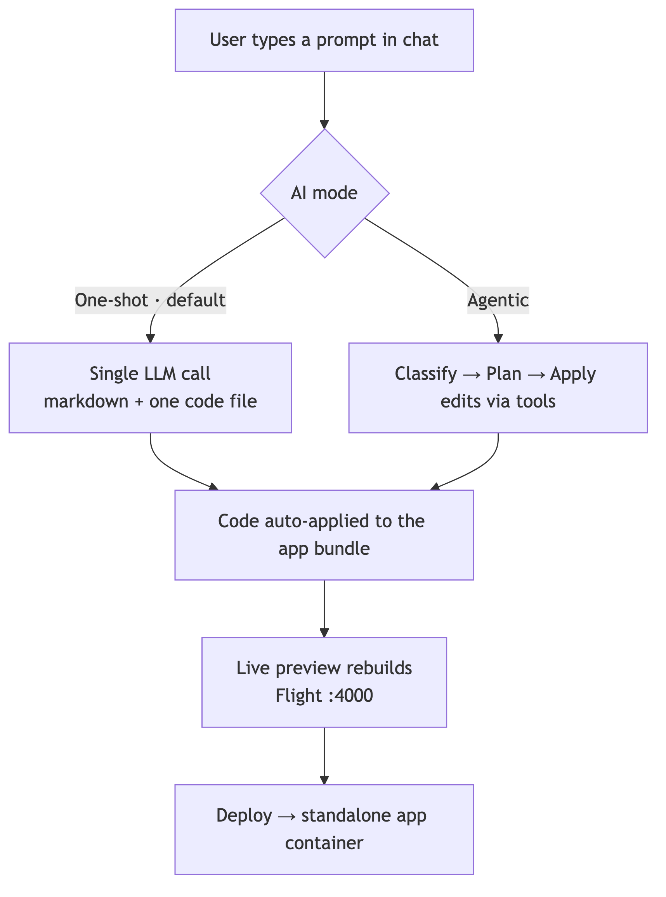
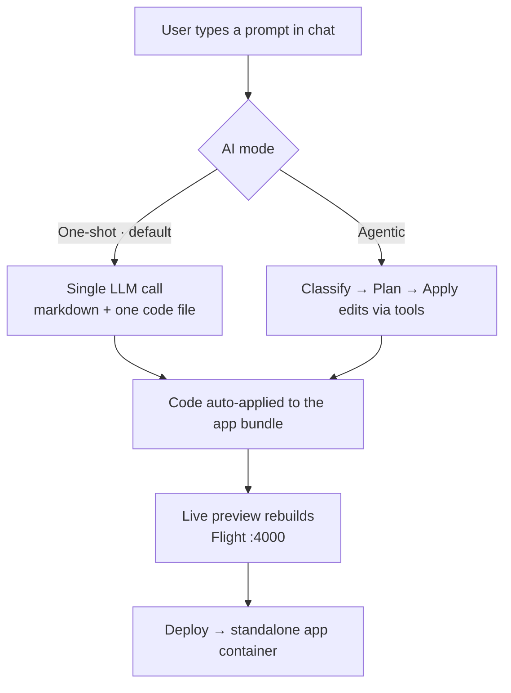

# Kota0 — Starter

> ThoughtPivot's **vibe coding engine**: turn a chat prompt into a real, deployable
> Vue + Flight app. A one-page primer.

## Aim

Let anyone **describe an app in plain language and ship it**. Kota0 takes a prompt,
has an LLM write the code, applies it to a live app bundle, previews it instantly, and
deploys it as a standalone container — a **plan → preview → ship** loop, no manual
chat-to-repo wiring.

## Overview

- **Workspace** — apps rail, AI chat panel, and **Preview** / **Code** tabs. Each app in
  the rail is its own Vue + Flight bundle.
- **AI** — Gemini (via Mastra) turns each message into code. Two modes, server-selected:
  - **One-shot** *(default)* — a single LLM call returns markdown with one full code file;
    it renders inline in chat and auto-applies. Fast.
  - **Agentic** — the model *classifies* the request, optionally *plans*, then *applies*
    edits through tools. Better for multi-step changes.
- **Preview** — the bundle is built and served by a child **Flight on :4000**, refreshed
  live after every change.
- **Deploy** — ships the bundle as its own container, reachable through the workspace.
- **Storage** — apps, chat, and revisions persist via **Scribe → PostgreSQL**.

## Block diagram — how a message becomes an app

Diagram source (Mermaid)

---

*More detail: [`README.md`](README.md) · architecture & ops: [`docs/deployment.md`](docs/deployment.md) · conventions: [`CLAUDE.md`](CLAUDE.md).*
